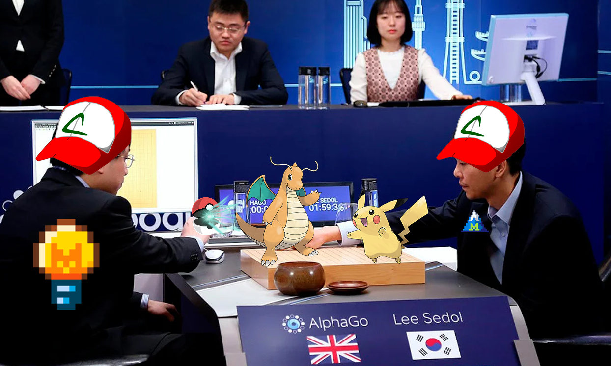
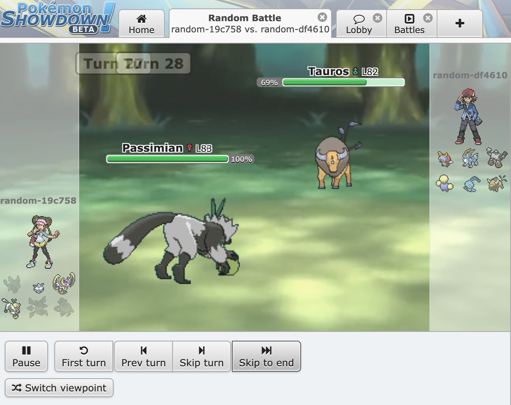

# alphaStral

A project by the Rustaceans Teams:

- Adrien Pelfresne [github](https://github.com/dirdr) | [linkedin](https://www.linkedin.com/in/adrien-pelfresne/) | [resume](https://raw.githubusercontent.com/dirdr/resume_adrien_pelfresne/main/raw/resume_adrien_pelfresne_software_engineer.pdf)

  > I'm Adrien Pelfresne, a 22 year old Backend Software engineer specializing in Distributed systems, If you are hiring at this position, please reach out to me :)

- Alexis Vapaille [github](https://github.com/AlexVplle) | [linkedin](https://www.linkedin.com/in/alexis-vapaille/) | [resume](https://alexvplle.com/CV_Alexis_Vapaille.pdf)

  > I'm Alexis Vapaille, a Backend Software Developer who loves Distributed Systems and Rust. I also build neural networks from scratch in Rust - check out [nn_lib](https://github.com/AlexVplle/nn_lib). If you are hiring, please reach out to me :)


## About

Fine-tuned vs Foundation, Who will win a Pokemon Showdown Match ?




### Showdown server


[Pokemon ShowDown](https://en.wikipedia.org/wiki/Pok%C3%A9mon_Showdown) is the biggest Pokemon Battle online platform. It will act as the game engine of the model battle.
Battles will run on the local machine running the program.
you will need to host an instance by following those steps:

```sh
git clone https://github.com/smogon/pokemon-showdown.git
cd pokemon-showdown
npm install
cp config/config-example.js config/config.js
node pokemon-showdown start --no-security
```

Then run battles:

```sh
uv run python main.py --p1 random --p2 random --n 10
```

> [!warning]
> Due to a bug, the live battle will only be available on Chrome and Firefox, Not safari :()

### CLI reference

```
uv run python main.py [OPTIONS]
```

| Argument               | Default            | Description                                                                    |
| ---------------------- | ------------------ | ------------------------------------------------------------------------------ |
| `--p1`                 | `random`           | Agent for player 1                                                             |
| `--p2`                 | `random`           | Agent for player 2                                                             |
| `--n`                  | `1`                | Number of battles to run                                                       |
| `--format`             | `gen9randombattle` | Battle format (poke-env format ID, e.g. `gen9ou`, `gen8randombattle`)          |
| `--move-delay SECONDS` | `0`                | Wait before each move, usefully set to `2`–`3` for comfortable live spectating |
| `--log-level`          | `INFO`             | Verbosity: `DEBUG` `INFO` `WARNING` `ERROR` (also `LOG_LEVEL` env var)         |

**Examples**

```sh
# 10 local battles, with no delay between move (this might go brrr)
uv run python main.py --p1 random --p2 random --n 10

# watch live (slowed down)
uv run python main.py --format gen9ou --n 1 --move-delay 2
```

## How to watch live battle ?

1. Start a battle (random vs random for reference):

```sh
uv run python main.py --p1 random --p2 random --move-delay 2
```

1. Go to the [locally hosted showdown](http://localhost:8000) and click `Watch Battle`, you will see the current running battle on the right side panel


1. Click on the current battle, and watch it !



## Results

After each run a JSON file lands in `runs/` and a visual HTML report in `reports/`.
Open the report in your browser.

```sh
uv run python -m viz runs/<your_run_file>.json
open reports/<your_run_file>.html
```


## Fine-tuning

> [!warning]
> To make thing go brrr, we bought collab pro and fine tuned our model on 100k samples with H100 GPU. Do not try this at home!


The dataset is scraped from Pokemon Showdown replays and enriched with PokeAPI data (types, stats, move power/category).

```sh
uv run python finetune/scraper.py
```

Each sample is a (prompt, completion) pair where the prompt describes the battle state and the completion is the chosen move. The dataset is split 95% train / 5% validation.

```json
{
  "prompt": "Turn 3. Weather: none. Your pokemon: Magnezone (99/100 HP, healthy) | Type: electric/steel | Atk: 70 SpA: 130 Spe: 60. Opponent: Raging Bolt (100/100 HP, healthy) | Type: electric/dragon | Def: 91 SpD: 89 Spe: 75 | Moves seen: Air Slash (flying, 75pw, special). What move do you use?",
  "completion": "Flash Cannon (steel, 80pw, special)"
}
```

### Test 1 - QLoRA on T4 (`finetune/finetune_colab_qlora.ipynb`)

First experiment run on a Colab T4. Dataset: gen9ou replays at 1500+ ELO. The model was loaded with 4-bit NF4 quantization to fit in VRAM. The adapter was pushed directly to HuggingFace Hub without merging.

**LoRA**

| Parameter      | Value                                                         |
| -------------- | ------------------------------------------------------------- |
| r              | 16                                                            |
| lora_alpha     | 16                                                            |
| target_modules | q_proj, k_proj, v_proj, o_proj, gate_proj, up_proj, down_proj |
| lora_dropout   | 0                                                             |
| bias           | none                                                          |

**Training**

| Parameter                   | Value                   |
| --------------------------- | ----------------------- |
| max_steps                   | 100                     |
| learning_rate               | 1e-4                    |
| warmup_steps                | 10                      |
| batch_size (per device)     | 4                       |
| gradient_accumulation_steps | 4 (effective batch: 16) |
| optimizer                   | paged_adamw_8bit        |
| eval / save every           | 50 steps                |
| max_length                  | 512                     |
| precision                   | bf16                    |

---

### Test 2 - LoRA on A100 (`finetune/finetune_colab.ipynb`)

Second experiment on an A100. Dataset: gen9randombattle replays. Quantization was dropped entirely in favor of full BF16, allowing a larger rank and 10x more training steps. LoRA weights were merged into the base model before pushing the full model to [mistral-hackaton-2026/ministral-3b-pokemon-showdown](https://huggingface.co/mistral-hackaton-2026/ministral-3b-pokemon-showdown) on HuggingFace Hub.

**LoRA**

| Parameter      | Value                                                         |
| -------------- | ------------------------------------------------------------- |
| r              | 32                                                            |
| lora_alpha     | 32                                                            |
| target_modules | q_proj, k_proj, v_proj, o_proj, gate_proj, up_proj, down_proj |
| lora_dropout   | 0                                                             |
| bias           | none                                                          |

**Training**

| Parameter                   | Value                   |
| --------------------------- | ----------------------- |
| max_steps                   | 1000                    |
| learning_rate               | 1e-4                    |
| warmup_steps                | 50                      |
| batch_size (per device)     | 16                      |
| gradient_accumulation_steps | 1 (effective batch: 16) |
| optimizer                   | adamw_torch             |
| eval / save every           | 200 steps               |
| max_length                  | 512                     |
| precision                   | bf16                    |

## Benchmarks

| Matchup | Battles | Win rate |
|---|---|---|
| AlphaStral vs ministral-3b-latest (3B) | 10 | **80%** |
| AlphaStral vs mistral-small-latest (24B) | 10 | **50%** |
| AlphaStral vs mistral-large-latest (123B) | 10 | **40%** |

## Potential improvements

- **Dataset diversity** - scraping more replays could improve generalization.
- **Richer prompt context** - adding held items to the prompt could help the model make better decisions.
- **Larger rank** - increasing `r` beyond 32 would give the adapters more capacity to learn complex battle strategies, at the cost of more VRAM.
