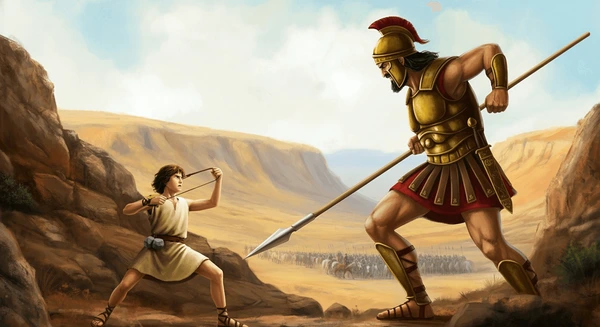

# alphaStral

A project by the Rustaceans Teams:

- Adrien Pelfresne [github](https://github.com/dirdr) | [linkedin](https://www.linkedin.com/in/adrien-pelfresne/) | [resume](https://raw.githubusercontent.com/dirdr/resume_adrien_pelfresne/main/raw/resume_adrien_pelfresne_software_engineer.pdf)

  > I'm Adrien Pelfresne, a 22 year old Backend Software engineer specializing in Distributed systems, If you are hiring at this position, please reach out to me :)

- Alexis Vapaille [github](https://github.com/AlexVplle) | [linkedin](https://www.linkedin.com/in/alexis-vapaille/) | [resume](https://alexvplle.com/CV_Alexis_Vapaille.pdf)

>


## About

Fine-tuned vs Foundation, Who will win a Pokemon Showdown Match ?



## Run The Battle

### Showdown server


[Pokemon ShowDown](https://en.wikipedia.org/wiki/Pok%C3%A9mon_Showdown) is the biggest Pokemon Battle online platform. It will be the game engine of the model battle.
Battles run fully on a local machine. Which is great because it is bypassing imposed limits with the official Showdown instance.

```sh
git clone https://github.com/smogon/pokemon-showdown.git
cd pokemon-showdown
npm install
cp config/config-example.js config/config.js
node pokemon-showdown start --no-security
```

Then run battles:

```sh
uv run python main.py --p1 random --p2 random --n 10
```

### CLI reference

```
uv run python main.py [OPTIONS]
```

| Argument               | Default            | Description                                                            |
| ---------------------- | ------------------ | ---------------------------------------------------------------------- |
| `--p1`                 | `random`           | Agent for player 1                                                     |
| `--p2`                 | `random`           | Agent for player 2                                                     |
| `--n`                  | `1`                | Number of battles to run                                               |
| `--format`             | `gen9randombattle` | Battle format (poke-env format ID, e.g. `gen9ou`, `gen8randombattle`)  |
| `--move-delay SECONDS` | `0`                | Wait before each move — set to `2`–`3` for comfortable live spectating |
| `--log-level`          | `INFO`             | Verbosity: `DEBUG` `INFO` `WARNING` `ERROR` (also `LOG_LEVEL` env var) |

**Examples**

```sh
# 10 local battles, with no delay between move (this might go brrr)
uv run python main.py --p1 random --p2 random --n 10

# watch live (slowed down)
uv run python main.py --format gen9ou --n 1 --move-delay 2
```

## Fine-tuning

The dataset is scraped from Pokemon Showdown replays (gen9ou, 1500+ ELO) and enriched with PokeAPI data (types, stats, move power/category).

```sh
uv run python finetune/scraper.py
```

The fine-tuning is done on Google Colab using the notebook at `finetune/finetune_colab.ipynb`.

Each sample looks like:

```json
{
  "prompt": "Turn 3. Weather: none. Your pokemon: Magnezone (99/100 HP, healthy) | Type: electric/steel | Atk: 70 SpA: 130 Spe: 60. Opponent: Raging Bolt (100/100 HP, healthy) | Type: electric/dragon | Def: 91 SpD: 89 Spe: 75 | Moves seen: Air Slash (flying, 75pw, special). What move do you use?",
  "completion": "Flash Cannon (steel, 80pw, special)"
}
```

## Model

The battle will be between
